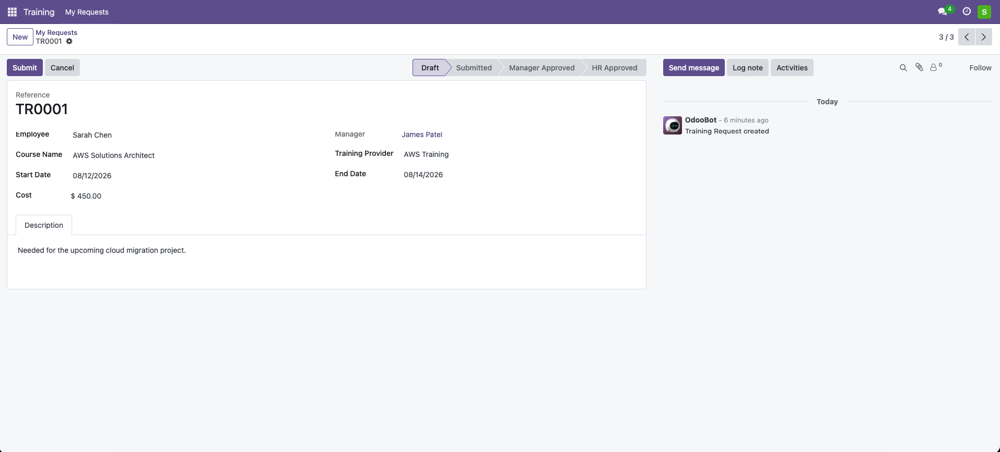
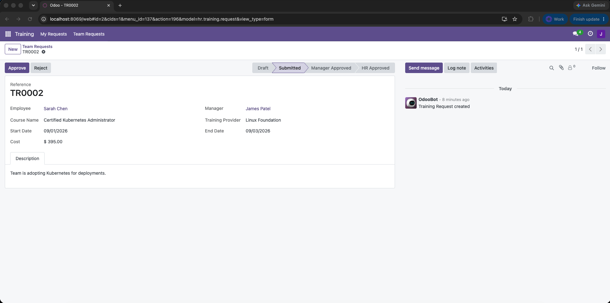
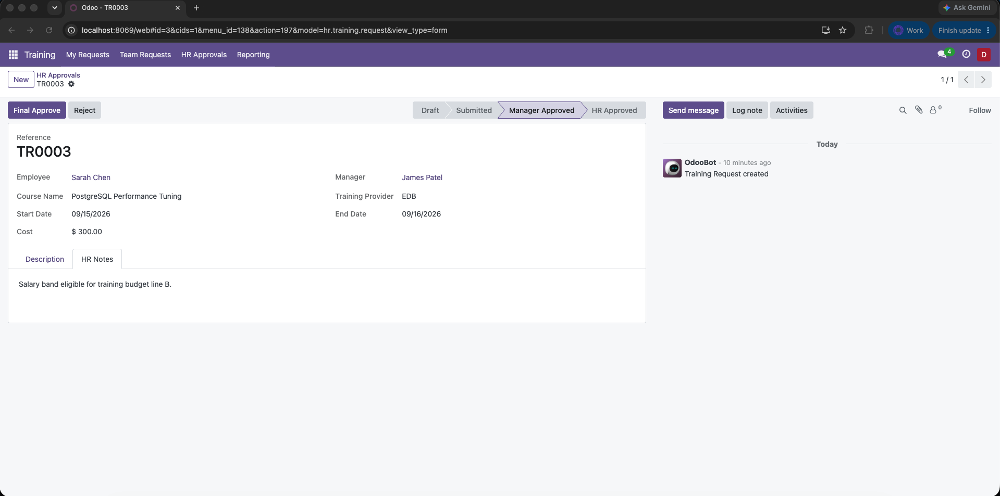
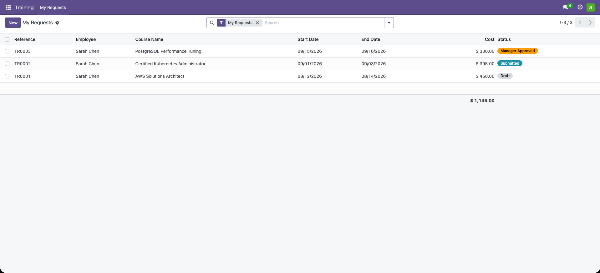

# HR Training Request


An Odoo module that lets employees request external training or certifications
and routes each request through a role-gated **Manager -> HR approval workflow**.
The emphasis is on security (record rules + access rights + server-side state
guards), a clean state machine, and role-based UI, rather than field breadth.

- **Odoo version:** 17.0 Community. The views use the 17+ syntax
  (`invisible=` / `readonly=` expressions, no `attrs` / `states`), so the code
  also loads on 18.0; on 18 the only change is renaming the `<tree>` tags to
  `<list>`.
- **Depends on:** `hr`, `mail`
- **License:** LGPL-3

---

## Screenshots

The same request seen by each role, showing that the buttons and the HR Notes
tab change with who is looking.

**Employee, draft stage** - fields editable, only Submit / Cancel, and no HR
Notes tab.



**Manager, submitted stage** - fields read-only, Approve / Reject for the
manager's own report, still no HR Notes tab.



**HR approver, manager-approved stage** - Final Approve / Reject, and the extra
**HR Notes** tab (open here) that only this role can see or edit.



**List view** - the status column uses colour-coded badges, and each role's menu
opens on the filter it cares about (here, the requester's "My Requests").



---

## 1. What is implemented

| Area | Summary |
|------|---------|
| Model `hr.training.request` | Employee (defaults to current user), related manager, course, provider, dates, cost, justification, HR notes, and a `state` selection. Sequenced reference (`TR0001`). |
| Security groups | Three custom groups (Requester, Manager Approver, HR Approver) in a cumulative hierarchy, HR reusing `hr.group_hr_user`. |
| Row-level security | `ir.model.access.csv` for CRUD **plus** record rules: own / own + reports / all-company (multi-company aware). |
| State machine | `draft -> submitted -> manager_approved -> hr_approved`, with `rejected` and `cancelled` branches. Every transition validated and role-checked in `write()`. |
| Role-based UI | Workflow buttons and the HR-notes field appear only for the right role at the right stage, and are enforced again in Python. Data fields lock after `draft`. |
| Reject reason | Rejecting opens a wizard that requires a reason; it is stored on the record and posted to the chatter. |
| Approver activities | On submit a to-do is scheduled for the manager; on manager approval it moves to the HR approvers; it is cleared when the request is finalised. |
| Email notifications | The requester is emailed (via `mail.template`) on final approval and on rejection (reason included). |
| Reporting | Pivot and graph views (cost by employee / state) under a Reporting menu for HR. |
| `hr.employee` | Computed `training_request_count` and a smart button, both filtered by the viewer's access rights. |
| Tracking | State changes and key fields logged to the chatter (`mail.thread`). |
| CI | GitHub Actions installs the module and runs the test suite on every push. |
| Demo data | One user per role, a reporting line, and sample requests in every stage. |
| Tests | A `TransactionCase` suite covering the security-critical paths. |

---

## 2. Project structure

```
hr_training_request/
├── __manifest__.py
├── models/
│   ├── hr_training_request.py     # model, state machine, guards, actions
│   ├── hr_training_request_reject_wizard.py   # mandatory reject reason
│   └── hr_employee.py             # count field + smart button
├── security/
│   ├── hr_training_request_security.xml   # groups + record rules
│   └── ir.model.access.csv                # table-level CRUD per group
├── data/
│   ├── ir_sequence_data.xml       # TR#### reference sequence
│   └── mail_template_data.xml     # approval / rejection emails
├── views/
│   ├── hr_training_request_views.xml      # form, tree, search, pivot, graph, actions
│   ├── hr_training_request_reject_wizard_views.xml
│   ├── hr_training_request_menus.xml      # role-targeted menus
│   └── hr_employee_views.xml              # smart button
├── demo/
│   └── hr_training_request_demo.xml
├── i18n/
│   └── hr_training_request.pot     # translation template
├── tests/
│   └── test_hr_training_request.py
├── .github/workflows/tests.yml    # CI: install + run tests
└── README.md
```

---

## 3. Running it locally

### Option A - Docker (nothing pre-installed needed)

This is the quickest way to try it on a machine that does not already have Odoo.
Run these from the folder that contains the `hr_training_request` directory.

```bash
# 1. PostgreSQL
docker run -d --name odoo-db \
  -e POSTGRES_USER=odoo -e POSTGRES_PASSWORD=odoo -e POSTGRES_DB=postgres \
  postgres:15

# 2. Odoo 17: mount the module, install it with demo data, expose port 8069
docker run -d --name odoo -p 8069:8069 \
  --link odoo-db:db \
  -e HOST=db -e USER=odoo -e PASSWORD=odoo \
  -v "$PWD/hr_training_request":/mnt/extra-addons/hr_training_request \
  odoo:17 odoo -d odoo -i hr_training_request

# 3. open http://localhost:8069  (first boot takes ~20-30s)
```

To stop and clean up:

```bash
docker rm -f odoo odoo-db
```

### Option B - an existing Odoo 17 install

Put the module on your addons path and install it with demo data:

```bash
./odoo-bin -d <db> --addons-path=<...>,/path/to/parent-of-module \
           -i hr_training_request
```

Demo data is loaded by default on a fresh database. Do **not** pass
`--without-demo=all` if you want the demo users below.

### Demo users (password = login)

| Login   | Name        | Role                                         |
|---------|-------------|----------------------------------------------|
| `sarah` | Sarah Chen  | Training Requester                           |
| `james` | James Patel | Training Manager Approver (Sarah's manager)  |
| `dana`  | Dana Ortiz  | Training HR Approver                         |

The built-in **Administrator** (`admin` / `admin`) also gets the HR Approver
role, so you can inspect everything from one login. Open the **Training** menu.

### Guided walkthrough (mirrors the three wireframes)

Because Odoo keeps one login per browser, open three windows (one normal, two
incognito) to act as three people at once.

1. As `sarah`: **Training > My Requests**, open the AWS draft, click **Submit**.
   Fields lock and only Sarah's own request is visible; she has no Approve button.
2. As `james`: **Training > Team Requests** (opens on his pending items), open the
   request, click **Approve**. Fields are read-only and there is no HR Notes tab.
3. As `dana`: **Training > HR Approvals** (opens on Pending HR Approval), open the
   request, and note the **HR Notes** tab that only HR sees, then **Final Approve**.

### Running the tests

```bash
# Docker
docker exec odoo odoo -d odoo -i hr_training_request \
  --test-enable --test-tags /hr_training_request --stop-after-init

# existing install
./odoo-bin -d <db> -i hr_training_request \
  --test-enable --test-tags /hr_training_request --stop-after-init
```

The suite exercises the role-gated transitions, illegal-jump blocking via raw
`write`, record-rule visibility per role, the HR-only field being stripped for
non-HR users, the cost/date validation, and the access-filtered smart-button
count.

---

## 4. Architecture and design decisions

### 4.1 Data model

`hr.training.request` inherits `mail.thread` and `mail.activity.mixin` for
chatter tracking. `manager_id` is a stored related field on
`employee_id.parent_id` so it can be used directly in record-rule domains (a
non-stored related field cannot be filtered in SQL). `cost` is a `Monetary`
field backed by a company-derived `currency_id`. The human-friendly `name`
(`TR0001`) comes from an `ir.sequence` assigned in `create()`.

### 4.2 Security: two independent layers

Row-level security never relies on hiding things in the view. It is enforced by:

1. **`ir.model.access.csv`** - table-level CRUD per group. Requester and Manager
   can read/write/create; HR can additionally unlink.
2. **Record rules (`ir.rule`)** - the row filter per group:
   - Requester: `employee_id.user_id == uid OR create_uid == uid` (own only)
   - Manager Approver: own **plus** direct reports (`manager_id.user_id == uid`)
   - HR Approver: everything in the user's allowed companies
     (`company_id in company_ids`, so multi-company stays isolated)

Record rules for the same operation are OR-combined across the groups a user
belongs to, so visibility widens automatically as you move up the hierarchy.

### 4.3 Security group hierarchy (and why)

```
Training HR Approver        final approval; sees all company requests + HR notes
      implies -> Training Manager Approver     approve/reject direct reports
            implies -> Training Requester      own requests
                  implies -> base.group_user   base internal user
Training HR Approver also implies hr.group_hr_user (reuse standard HR access)
```

A **linear, cumulative hierarchy** is used because access in this process is
genuinely additive: a manager can do everything a requester can plus approve for
their reports, and HR can do everything a manager can plus give final approval
and see the internal notes. Using `implied_ids` means each group only declares
the *delta* it adds, and the record rules combine so the effective visibility
grows by itself. HR implies the stock `hr.group_hr_user` instead of redefining
employee-data access, which is the "reuse existing hr groups where sensible"
point from the brief.

### 4.4 State machine - one place to enforce everything

The allowed transitions live in a single `_TRANSITIONS` map on the model. All
state changes go through `write()`, which calls `_check_transition()` for every
record before delegating to `super()`. That method does two things:

- refuses any transition not present in `_TRANSITIONS` (so no illegal jump such
  as `draft -> hr_approved` is possible from the UI, XML-RPC or the shell), and
- checks the acting user's role for that specific transition (owner submits and
  cancels; the employee's manager approves/rejects at `submitted`; an HR approver
  approves/rejects at `manager_approved`).

The six `action_*` button methods are thin wrappers that just set the target
state, so authorisation is defined exactly once. This is the "never trust the
client" requirement: even a direct `write({'state': ...})` from an external
script is validated. `end_date >= start_date` and non-negative `cost` are
enforced both by `@api.constrains` (always) and re-checked at submission.

### 4.5 Role-based UI without trusting the UI

Button visibility is driven by four computed booleans - `can_submit`,
`can_cancel`, `can_manager_review`, `can_hr_review` - which reuse the exact same
role predicates that `write()` uses. That keeps the buttons and the server in
agreement: a button is shown only when the corresponding server-side action
would actually succeed. The `groups=` attributes on the buttons are an extra
convenience, not the enforcement.

The **HR Notes** field is declared with a field-level
`groups="...group_training_hr_approver"`. The ORM removes the field entirely
from reads and writes for anyone outside that group, so it is hidden over RPC as
well, not merely dropped from the form. Data fields (`cost`, `justification`,
dates, provider) become read-only once the request leaves `draft`.

### 4.6 `hr.employee` extension

`training_request_count` is computed with `read_group`, which runs as the
current user and therefore already honours the record rules - a viewer only
counts requests they may see. The compute is decorated with
`@api.depends_context('uid')` so its cached value is keyed per user rather than
shared within a transaction. The smart button opens the requests filtered to
that employee, with the record rules still applying on top.

### 4.7 Reject reason and approver activities

Rejecting is a decision that should be explained, so both reject buttons open a
small `TransientModel` wizard that requires a reason. The wizard calls back into
`_apply_rejection()`, which writes the state through the same guarded `write()`
(so the stage-appropriate role is still enforced), stores the reason and posts
it to the chatter.

To make the workflow push rather than pull, a to-do activity is scheduled for
the next approver: for the manager on submit, and for the HR approvers on
manager approval. Activities are cleared when the request is approved, rejected
or cancelled, so nobody is left with a stale task. On final approval or
rejection the requester is also emailed via a `mail.template` (the rejection
email includes the reason).

### 4.8 `sudo()`

The only `sudo()` in the module is in `_hr_approver_users()`, used purely to read
who belongs to the HR approver group so their activities can be scheduled. It is
commented in the code. It does not touch the training-request records or bypass
any of their access rules; all data access stays rule-respecting.

---

## 5. State machine

```
        submit                 manager approve            hr approve
draft ─────────▶ submitted ──────────────────▶ manager_approved ──────────▶ hr_approved
  │                 │  │                             │
  │ cancel          │  │ manager reject              │ hr reject
  ▼                 ▼  ▼                             ▼
cancelled       cancelled  rejected              rejected
```

- `rejected` is reachable from `submitted` (manager) or `manager_approved` (HR).
- `cancelled` is reachable only from `draft` or `submitted`, and only by the owner.
- `hr_approved`, `rejected` and `cancelled` are terminal.

---

## 6. Assumptions

- **"The employee's manager (or someone in the Manager Approver group)"** is read
  as: the acting user must be in the Manager Approver group **and** be the
  employee's direct manager (`manager_id.user_id == uid`). This is consistent with
  the record rule that only lets managers see their reports' requests, so a
  manager can never act on someone they do not manage. HR is kept separate from
  manager approval.
- **`justification`** is surfaced as the **Description** notebook tab (as in the
  wireframes), since it is the free-text rationale for the request.
- **`end_date`** may equal `start_date` (single-day courses are common), so the
  rule enforced is "not before", messaged as "on or after". Switching to a strict
  "after" is a one-line change.
- A **reference number** (`TR0001`) via `ir.sequence` is added for a friendlier
  record name; the wireframes show one even though the spec did not require it.
- `employee_id` is editable while in `draft` (defaulting to the current user) so
  HR can raise a request on someone's behalf; it locks once submitted.
- Multi-company is supported through `company_id` and the company-scoped HR rule.

---

## 7. What I would improve with more time

- Budget or approval-limit logic, for example auto-routing high-cost requests to
  a second approver.
- A configurable approval chain instead of the fixed manager then HR path.
- A portal view so employees without backend access could submit requests.
